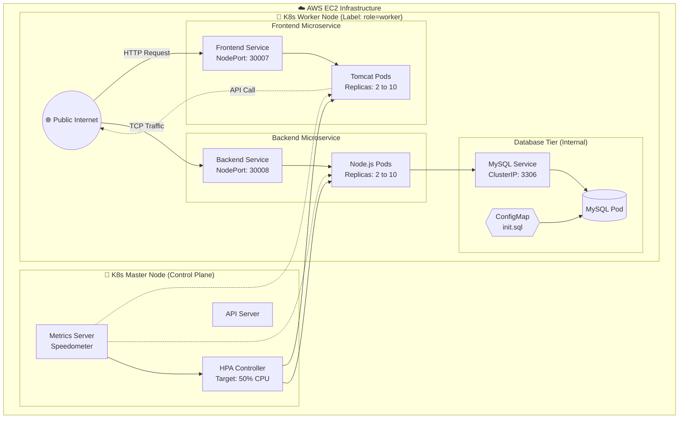

# 📈 Monolith to Microservices: Kubernetes Auto-Scaling Architecture

---

## 📑 Table of Contents
1. [🎯 Project Description: The Auto-Scaling Laboratory](#-1-project-description-the-auto-scaling-laboratory)  
2. [🌍 The Industry Problem & Our Solution](#-2-the-industry-problem--our-solution)  
3. [🏗️ Architecture & Autoscaling Flow](#️-3-architecture--autoscaling-flow)  
4. [⚡ Setup, Code & Implementation](#-4-setup-code--implementation)  

---

## 🎯 1. Project Description: The Auto-Scaling Laboratory

This project serves as a **hands-on DevOps laboratory** to master:

- Kubernetes orchestration  
- Dynamic auto-scaling  
- Microservices decoupling  

A Netflix mock application is used to simulate a **real-world high-traffic platform**, transitioning from a static containerized setup into a **fully autonomous Kubernetes cluster**.

---

### 🚀 Primary Functionality & Key Features

#### 🔹 Decoupled Microservices
- Java/Tomcat frontend and Node.js backend run as **independent Kubernetes Deployments**
- Enables **independent scaling and fault isolation**

---

#### 🔹 Horizontal Pod Autoscaler (HPA)
- Integrated with **Kubernetes Metrics Server**
- Dynamically scales pods:
  - Minimum: `2`
  - Maximum: `10`
- Trigger condition: **CPU utilization > 50%**

---

#### 🔹 Control Plane Protection
- Enforced using `nodeSelector`
- Ensures:
  - Application pods run **only on worker nodes**
  - Master node remains **isolated and stable**

---

#### 🔹 Automated Database Provisioning
- Uses **ConfigMaps**
- Injects `init.sql` into MySQL container at startup
- Eliminates **manual DB setup**

---

### 🎯 Target Audience
- Cloud Engineers  
- Site Reliability Engineers (SREs)  
- DevOps Practitioners  

---

## 🌍 2. The Industry Problem & Our Solution

### ❌ The Pain Point: The "Over-Provisioning" Trap

Traditional monolithic systems suffer from:

- Static infrastructure  
- Poor scalability  
- High cloud costs  

When traffic spikes:
- CPU gets exhausted  
- Entire application crashes  

To prevent this:

> Companies over-provision expensive servers that remain idle ~90% of the time.

Additionally:
- Backend load forces scaling of entire app (including frontend)
- Leads to **resource wastage**

---

### ✅ Our Solution: Granular, Demand-Driven Infrastructure

#### 💰 Cost Efficiency
- Kubernetes HPA maintains:
  - **Low baseline (2 pods)** during normal load  
  - **Auto scale-up** during traffic spikes  
  - **Auto scale-down** after load drops  

👉 Result: Optimized AWS compute cost

---

#### 🔥 Independent Scaling & Fault Isolation
- Backend and frontend are decoupled

Example:
- Backend scales → `10 pods`
- Frontend remains → `2 pods`

👉 Benefits:
- Efficient scaling  
- Reduced blast radius  
- Improved availability  

---

## 🏗️ 3. Architecture & Autoscaling Flow


## ⚡ 4. Setup, Code & Implementation

### 🔧 Prerequisites

- Kubernetes Cluster (**Master + Worker nodes**)  
- `kubectl` configured on Master node  
- AWS Security Group:
  - Allow **TCP 30007 & 30008** from `0.0.0.0/0`

---

### 🏷️ Node Labeling

```bash
kubectl label nodes <worker-node-name> role=worker
```
### 📂 Directory Structure
```
netflix-k8s-autoscaler/
├── frontend/
│   └── k8s/
│       ├── frontend-deployment.yaml
│       ├── frontend-service.yaml
│       └── frontend-hpa.yaml
├── backend/
│   └── k8s/
│       ├── backend-deployment.yaml
│       ├── backend-service.yaml
│       └── backend-hpa.yaml
└── database/
    └── k8s/
        ├── mysql-secret.yaml
        ├── mysql-configmap.yaml
        ├── mysql-deploy.yaml
        └── mysql-service.yaml
```
### 📜 Core Implementation Files
#### 1️⃣ Database ConfigMap (Zero-Touch Provisioning)
```
apiVersion: v1
kind: ConfigMap
metadata:
  name: mysql-init-script
data:
  init.sql: |
    CREATE DATABASE IF NOT EXISTS netflix_db;
    USE netflix_db;
    CREATE TABLE IF NOT EXISTS users (
        id INT AUTO_INCREMENT PRIMARY KEY,
        email VARCHAR(255) NOT NULL,
        password VARCHAR(255) NOT NULL
    );
    INSERT INTO users (email, password) VALUES ('admin@netflix.com', 'password123');
```
#### 2️⃣ Backend Deployment (Node Selector + Resource Limits)
```
apiVersion: apps/v1
kind: Deployment
metadata:
  name: backend-deployment
spec:
  replicas: 2
  selector:
    matchLabels:
      app: netflix-backend
  template:
    metadata:
      labels:
        app: netflix-backend
    spec:
      nodeSelector:
        role: worker
      containers:
      - name: node-backend
        image: parte15/netflix-backend:v2
        ports:
        - containerPort: 5000
        resources:
          requests:
            cpu: "100m"
          limits:
            cpu: "250m"
```
#### 3️⃣ Horizontal Pod Autoscaler (HPA)
```
apiVersion: autoscaling/v2
kind: HorizontalPodAutoscaler
metadata:
  name: backend-hpa
spec:
  scaleTargetRef:
    apiVersion: apps/v1
    kind: Deployment
    name: backend-deployment
  minReplicas: 2
  maxReplicas: 10
  metrics:
  - type: Resource
    resource:
      name: cpu
      target:
        type: Utilization
        averageUtilization: 50
```
### 🚀 Quick Spin-Up
- Run these commands from the Master Node:
```
# 1. Deploy Database
kubectl apply -f database/k8s/

# 2. Deploy Backend
kubectl apply -f backend/k8s/

# 3. Deploy Frontend
kubectl apply -f frontend/k8s/

# 4. Verify Pods
kubectl get pods -o wide

# 5. Watch Autoscaler
kubectl get hpa -w
```
### 🎯 Final Note
